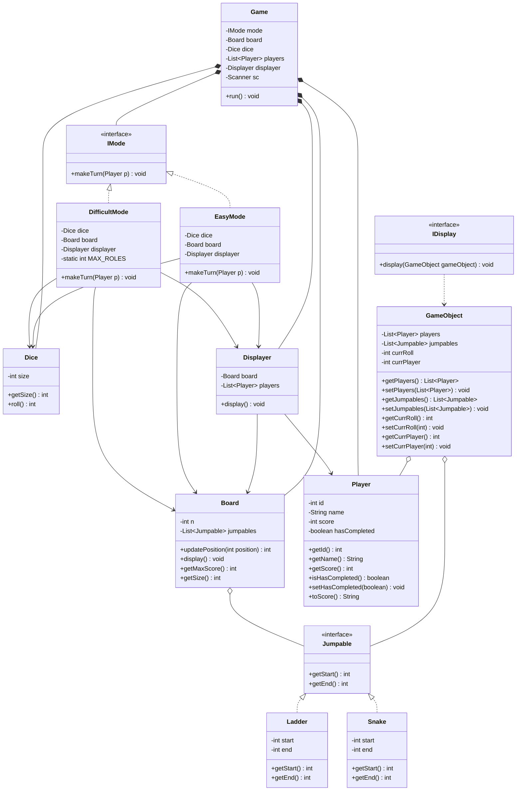

# Snakes and Ladders - Design Documentation

## Class Diagram



## System Architecture

### Core Components

#### 1. **Board**

- Represents the game board as an n×n grid
- Manages jumpable entities (snakes and ladders)
- Handles position updates when a player lands on a jumpable
- Provides board size and maximum score calculation

#### 2. **Player**

- Contains player state: id, name, score, completion status
- Tracks current position on the board
- Manages completion flag when reaching the final position

#### 3. **Dice**

- Encapsulates dice rolling logic
- Configurable size (default: 6-sided)
- Generates random values between 1 and dice size

#### 4. **Game**

- Main game controller
- Orchestrates game flow and turn management
- Manages players, board, dice, mode, and displayer
- Implements game loop until all players complete

#### 5. **GameObject**

- Data transfer object for display purposes
- Encapsulates current game state: players, jumpables, current roll, current player
- Used to pass state information to the displayer

#### 6. **Displayer**

- Handles visual representation of the game
- Displays board grid with player positions
- Shows player scores
- Players represented as characters (A, B, C, etc.)

## Design Patterns

### 1. **Strategy Pattern (IMode)**

- **Interface**: `IMode`
- **Implementations**: `EasyMode`, `DifficultMode`
- **Purpose**: Allows different game rule variations without changing core game logic

**Easy Mode**:

- Player continues rolling on getting 6
- No limit on consecutive sixes

**Difficult Mode**:

- Player continues rolling on getting 6
- Maximum 3 consecutive sixes allowed per turn
- Turn ends after 3 consecutive sixes

### 2. **Polymorphism (Jumpable)**

- **Interface**: `Jumpable`
- **Implementations**: `Snake`, `Ladder`
- **Purpose**: Unified handling of different jump types
- Both implement `getStart()` and `getEnd()` methods
- Board processes all jumpables uniformly

### 3. **Dependency Injection**

- Game components injected through constructors
- Modes receive Board, Dice, and Displayer as dependencies
- Enables loose coupling and easier testing

## Class Relationships

```
Game
├── Board
│   └── List<Jumpable>
│       ├── Snake
│       └── Ladder
├── Dice
├── IMode (Strategy)
│   ├── EasyMode
│   └── DifficultMode
├── Displayer
│   ├── Board
│   └── List<Player>
└── List<Player>
```

## Interfaces

### IMode

```java
void makeTurn(Player p)
```

Defines the contract for game mode implementations.

### Jumpable

```java
int getStart()
int getEnd()
```

Defines the contract for board jump entities.

### IDisplay

```java
void display(GameObject gameObject)
```

Defines the contract for display strategies (currently unused in active code).

## Game Flow

1. **Initialization**
   - Create players, board, dice, and jumpables
   - Initialize game with selected mode
   - Set up displayer

2. **Game Loop**
   - Iterate through each player
   - Skip completed players
   - Execute mode-specific turn logic
   - Wait for user input between turns
   - Check win condition after each round

3. **Turn Execution**
   - Roll dice
   - Update player score
   - Check for jumpables at new position
   - Apply snake/ladder jump if applicable
   - Validate win or overshoot condition
   - Display updated board state
   - Continue if rolled 6 (mode-dependent rules)

4. **Win Condition**
   - Player reaches exact final position (n×n)
   - Overshooting is not allowed (turn ends)

## Key Design Decisions

### Position Management

- Positions are 0-indexed internally
- Board size n×n with maximum score n²
- Position validation prevents out-of-bounds scores

### Turn Management

- Turn-based gameplay with player rotation
- Completed players skipped in subsequent rounds
- Game continues until all players finish

### Display Strategy

- Grid-based visualization
- Players shown as alphabetic characters based on ID
- Board rendered bottom-up (matching traditional board game layout)
- Score displayed below board for all players

### Mode Extensibility

- New game modes can be added by implementing IMode
- No modification to core Game class required
- Mode-specific rules encapsulated within mode classes
